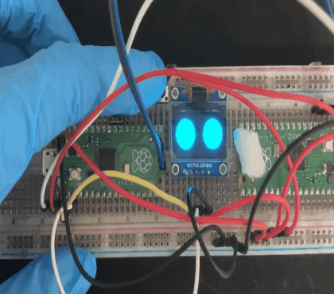
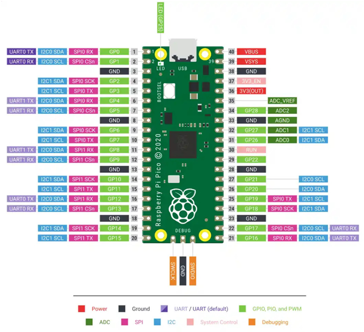

# Raspberry Pi Picoとpico-ssd1306用いて瞬き表示

Raspberry Pi Pico(RP2040)を用いてディスプレイに瞳を表示しボタン(GP16)押下で瞬きをする仕組みを作成しました。\
機能についてはシンプルな瞬きのみの状態になっていますが、ビットマップ画像を複数作成&登録やGPIOの設定を行えば喜怒哀楽の表現や割り込みで別顔への遷移など複雑に行うことができます。

 

# RP2040
データシートからGPIO図

 

# pico-ssd1306
Raspberry Pi Pico と pico-sdkを用いてssd1306ディスプレイに表示する\
※外部ライブラリを使用しているため詳細は→(https://github.com/daschr/pico-ssd1306)

 

# 実装環境

**実行・ビルド**
- VSCode
- CMake

**コンパイラ**
- GNU Arm Embedded Toolchain 10.3-2021.10

**バージョン管理**
- Git
- GitHub

**使用マイコン**
- RP2040 (Pico)
- ssd1306 (OLED)

**ビットマップ**
- AviUtl

 

# 考慮・工夫した部分
シンプルなデザインで実装できることを考えました。AviUtlを用いて動画からビットマップ画像生成をすることで表情の遷移をより具体的にイメージできより自然な瞬きになるように工夫しました。\
またビットマップ作成時に色ビット数により1bit～24bitと幅広いため対応bitの考慮して実装しています。(0xFF => 16bitで表現)\
外部ライブラリを使用しているため環境構築や仕組みの理解が大変でした。ビットマップの配列格納などの基本的な部分が分かればGPIOの操作で応用できると思われます。

 

# 今後の課題
* 割り込み処理を実装し別状態に遷移できるようにする
* 初期起動時に画面をクリアするように
* 他モジュール(モーター、上位ドライバ)を作成し結合
